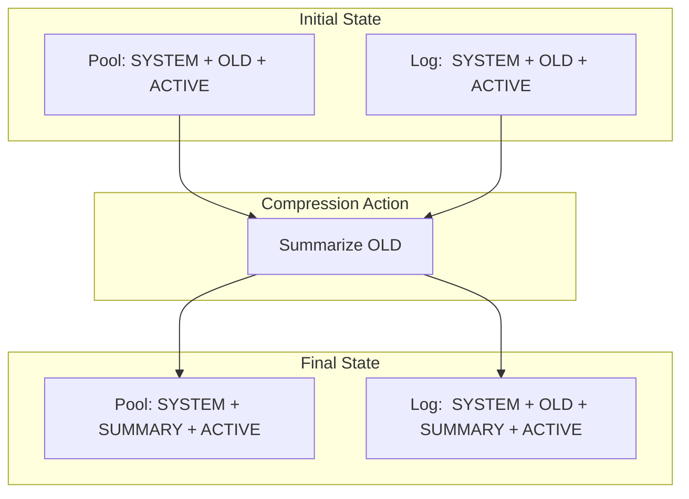

# Context Compression & Logging Sync Design

## Objective
Establish a canonical behavior for context compression that satisfies both memory efficiency (Pool) and audit persistence (Logs), without causing message duplication or "ghost echoes".

## The Hybrid Model

### 1. AgentPool (Memory): Destructive
- **Behavior**: When compression is triggered, the oldest messages (grey section) are **removed** from the `instance_conversations` list.
- **Result**: `[SYSTEM, <context_summary>, ...active_messages]`
- **Rationale**: Keeps the application state lean and prevents the UI/state from bloating with redundant data that has already been summarized.

### 2. Agent Log (Disk): Cumulative with Markers
- **Behavior**: The log file **preserves** the full linear history. When compression occurs, a `<context_summary>` message is inserted into the log at the point of compression (the boundary between summarized and active messages).
- **Result**: `[SYSTEM, ...summarized_messages, <context_summary>, ...active_messages]`
- **Rationale**: Maintains a full audit trail of everything the agent has said or done, while marking exactly when and where a compression event occurred.

### 3. AgentOrchestrator (Synchronization): The "T-x" Strategy
- **Behavior**: The orchestrator maintains a `conv` (snapshot) and `resp` (current turn).
- **Log Sync**: When logging, it must be aware that the Pool history is a *subset* of the Log history.
- **Deduplication**: The `AgentInstanceLogger` must use a robust content-matching algorithm (ignoring metadata like timestamps) to ensure that it doesn't re-append active messages that already exist in the log after a summary insertion.

## Implementation Details

### AgentPool._apply_context_compression
- Calculate `num_to_remove`.
- **Destructive**: Pop the messages from the `history` list.
- **Log Command**: Tell the logger to "Insert Summary at T-x". This will be a special `rewrite` operation that preserves the prefix but adds the marker and the tail.

### AgentInstanceLogger.update_history
- Improve the `normalize` function to be even more resilient (strip timestamps and extra metadata).
- **Prefix Matching**: Find the furthest point where the memory history matches the log history.
- **Mismatch Handling**: If a mismatch occurs, check if the remaining log content matches the memory content *after* skipping the summary marker. If yes, it's a valid continuation; do nothing.

## Visual Flow (Per User Diagram)

## Why this fixes Duplication
Duplication happened because:
1. Pool was non-destructive.
2. Log was cumulative.
3. Logger saw `[S, OLD, SUMMARY, ACTIVE]` in Pool and `[S, OLD, ACTIVE]` in Log.
4. Prefix match stopped at `SUMMARY`.
5. Logger appended `SUMMARY + ACTIVE`.
6. Result: `[S, OLD, ACTIVE, SUMMARY, ACTIVE]`. (**ACTIVE is repeated!**)

**The Fix**: By making the Pool **Destructive**, the logger sees:
Pool: `[S, SUMMARY, ACTIVE]`
Log:  `[S, OLD, ACTIVE]`
Logger will now be told to **INSERT** the summary at the boundary, resulting in a clean `[S, OLD, SUMMARY, ACTIVE]` without repeating the tail.
