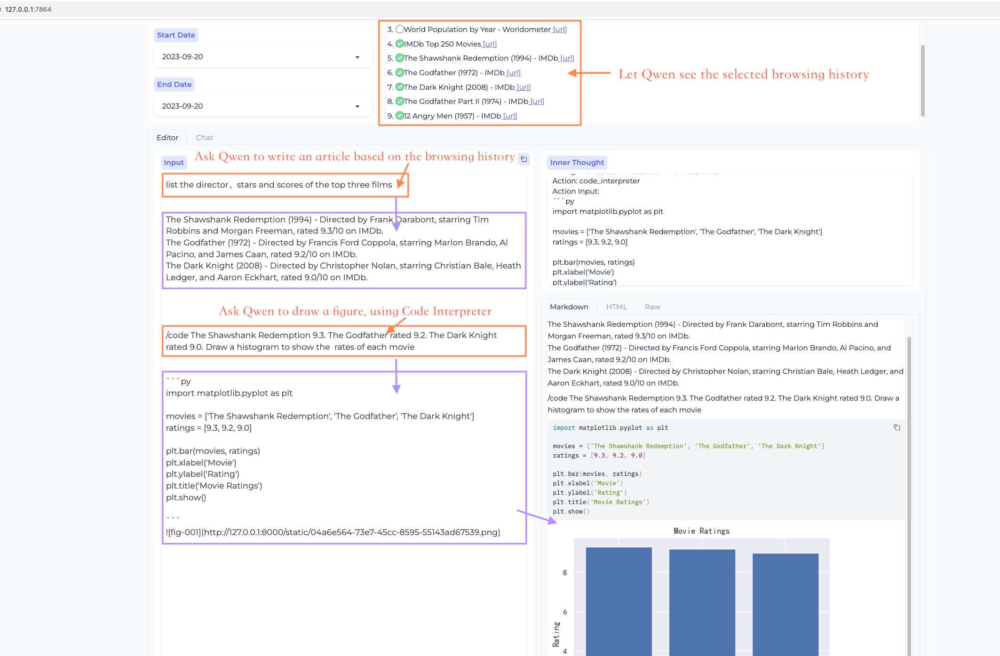
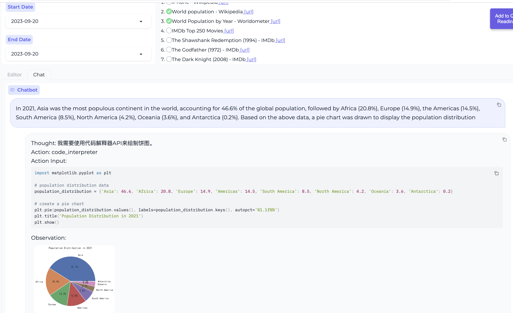
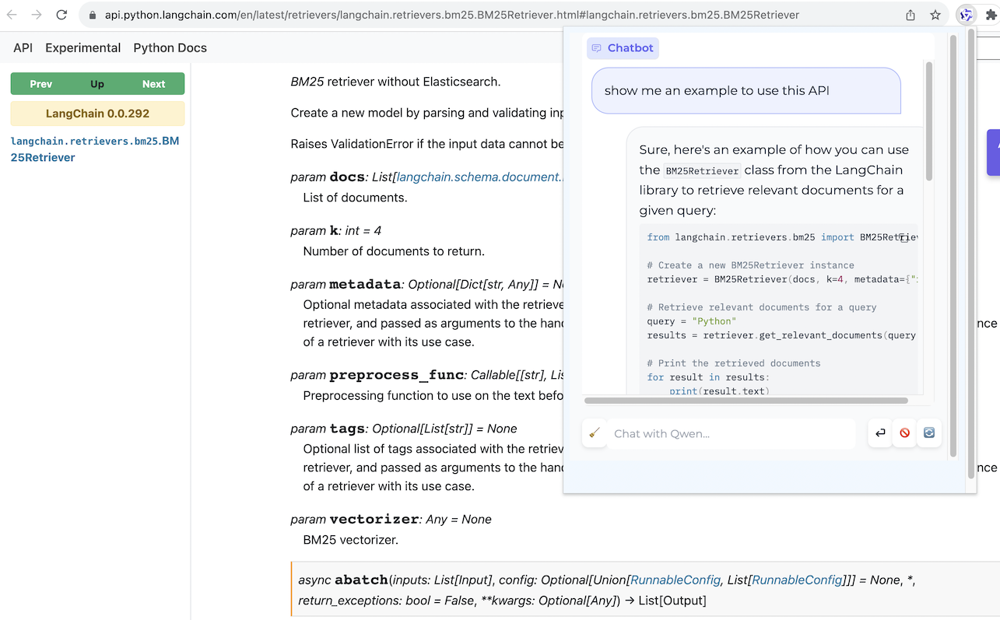
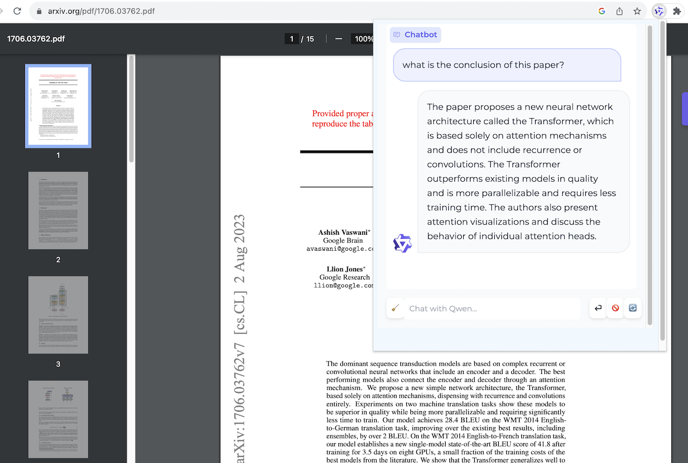

<!---
Copyright 2023 The Qwen team, Alibaba Group. All rights reserved.

Licensed under the Apache License, Version 2.0 (the "License");
you may not use this file except in compliance with the License.
You may obtain a copy of the License at

   http://www.apache.org/licenses/LICENSE-2.0

Unless required by applicable law or agreed to in writing, software
distributed under the License is distributed on an "AS IS" BASIS,
WITHOUT WARRANTIES OR CONDITIONS OF ANY KIND, either express or implied.
See the License for the specific language governing permissions and
limitations under the License.
-->

# Example Application: BrowserQwen

We have also developed an example application based on AgentCascade: a **Chrome browser extension** called BrowserQwen,
which has key features such as:

- You can discuss with Qwen regarding the current webpage or PDF document.
- It records the web pages and PDF/Word/PowerPoint materials that you have browsed. It helps you understand multiple
  pages, summarize your browsing content, and automate writing tasks.
- It comes with plugin integration, including **Code Interpreter** for math problem solving and data visualization.

## BrowserQwen Demonstration

You can watch the following showcase videos to learn about the basic operations of BrowserQwen:

- Long-form writing based on visited webpages and
  PDFs. [video](https://qianwen-res.oss-cn-beijing.aliyuncs.com/assets/agent_cascade/showcase_write_article_based_on_webpages_and_pdfs.mp4)
- Drawing a plot using code interpreter based on the given
  information. [video](https://qianwen-res.oss-cn-beijing.aliyuncs.com/assets/agent_cascade/showcase_chat_with_docs_and_code_interpreter.mp4)
- Uploading files, multi-turn conversation, and data analysis using code
  interpreter. [video](https://qianwen-res.oss-cn-beijing.aliyuncs.com/assets/agent_cascade/showcase_code_interpreter_multi_turn_chat.mp4)

### Workstation - Editor Mode

**This mode is designed for creating long articles based on browsed web pages and PDFs.**

<figure>
    
</figure>

**It allows you to call plugins to assist in rich text creation.**

<figure>
    
</figure>

### Workstation - Chat Mode

**In this mode, you can engage in multi-webpage QA.**

<figure >
    
</figure>

**Create data charts using the code interpreter.**

<figure>
    
</figure>

### Browser Assistant

**Web page QA**

<figure>
    
</figure>

**PDF document QA**

<figure>
    
</figure>

## BrowserQwen User Guide

### Step 1. Deploy Local Database Service

On your local machine (the machine where you can open the Chrome browser), you will need to deploy a database service to
manage your browsing history and conversation history.

If you are using DashScope's model service, then please execute the following command:

```bash
# Start the database service, specifying the model on DashScope by using the --llm flag.
# The value of --llm can be one of the following, in increasing order of resource consumption:
#   - qwen1.5-7b/14b/72b-chat (the same as the open-sourced Qwen1.5 7B/14B/72B Chat model)
#   - qwen-turbo, qwen-plus, qwen-max (qwen-max is recommended)
# "YOUR_DASHSCOPE_API_KEY" is a placeholder. The user should replace it with their actual key.
# The legacy run_server.py has been replaced by start_api_server.py.
# For the browser agent workstation, use the API server entry point instead:
python start_api_server.py
```

If you need to specify a custom port, set an environment variable before launching:

```bash
# Example: Use a different port for the API server
set QWEN_AGENT_PORT=8765
python start_api_server.py
```

Now you can access [http://127.0.0.1:7864/](http://127.0.0.1:7864/) to use the Workstation's Editor mode and Chat mode.

### Step 2. Install Browser Assistant

Install the BrowserQwen Chrome extension:

- Open the Chrome browser and enter `chrome://extensions/` in the address bar, then press Enter.
- Make sure that the `Developer mode` in the top right corner is turned on, then click on `Load unpacked` to upload
  the `browser_agent` directory from this project and enable it.
- Click the extension icon in the top right corner of the Chrome browser to pin BrowserQwen to the toolbar.

Note that after installing the Chrome extension, you need to refresh the page for the extension to take effect.

When you want Qwen to read the content of the current webpage:

- Click the `Add to Qwen's Reading List` button on the screen to authorize Qwen to analyze the page in the background.
- Click the Qwen icon in the browser's top right corner to start interacting with Qwen about the current page's content.
